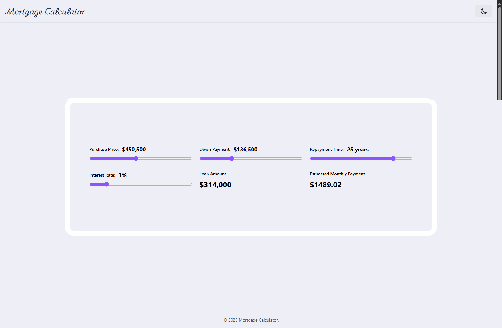

# Mortgage Calculator

A modern, responsive mortgage calculator built with React and TypeScript. This project was developed as a solution to the [Mortgage Calculator Web App Challenge](https://www.codementor.io/projects/web/mortgage-calculator-web-app-d16bqrq2q3) on Codementor, with additional features and custom design elements.



## Learning Outcomes

### 1. Advanced State Management with useReducer
This project was a great opportunity to learn and implement `useReducer` for complex state management. Key learnings include:
- Managing multiple related state values in a single reducer
- Implementing type-safe actions with TypeScript
- Understanding when to use `useReducer` vs `useState`
- Handling complex state updates in a predictable way

```typescript
// Type-safe state interface
interface MortgageState {
    purchasePrice: number;
    downPayment: number;
    repaymentTime: number;
    interestRate: number;
}

// Type-safe action interface
type MortgageAction = {
    type: 'UPDATE_VALUE';
    name: keyof MortgageState;
    value: number;
};

// Reducer function with predictable state updates
function mortgageReducer(state: MortgageState, action: MortgageAction): MortgageState {
    switch (action.type) {
        case 'UPDATE_VALUE':
            return { ...state, [action.name]: action.value };
        default:
            return state;
    }
}
```

### 2. Tailwind CSS Dark Mode Implementation
Learned how to implement a responsive dark/light mode using Tailwind CSS:
- Using `dark:` variant for dark mode styles
- Implementing color schemes with CSS variables
- Creating responsive layouts with Tailwind's utility classes

```typescript
// Example of dark mode implementation
<div className="bg-main dark:bg-gray-900 rounded-2xl dark:text-white">
    {/* Content */}
</div>
```

### 3. Component Architecture
Developed a deep understanding of React component architecture:
- Creating reusable components with TypeScript
- Implementing proper prop typing
- Building custom form controls
- Managing component state and props

### 4. TypeScript Integration
Enhanced TypeScript skills through:
- Interface definitions for props and state
- Type-safe event handlers
- Generic type usage
- Type guards and assertions

## Features

- 🏠 Calculate monthly mortgage payments
- 💰 Real-time loan amount calculation
- 📊 Interactive range sliders for all inputs
- 🌓 Dark/Light mode support
- 📱 Fully responsive design
- 💵 Proper currency formatting
- ⚡ Instant calculations

## Technologies Used

- **React** - Frontend library
- **TypeScript** - Type safety and better development experience
- **Tailwind CSS** - Utility-first CSS framework
- **useReducer** - State management for complex calculations
- **React Hooks** - useState, useReducer for state management

## Project Structure

```
src/
├── components/
│   ├── Calculator.tsx    # Main calculator component
│   ├── Range.tsx         # Custom range input component
│   └── SummaryItem.tsx   # Summary display component
├── App.tsx
└── main.tsx
```

## Getting Started

1. Clone the repository:
```bash
git clone https://github.com/yourusername/mortgage-calculator.git
```

2. Install dependencies:
```bash
npm install
```

3. Run the development server:
```bash
npm run dev
```

4. Open [http://localhost:5173](http://localhost:5173) in your browser

## Project Challenge

This project was developed as a solution to the [Mortgage Calculator Web App Challenge](https://www.codementor.io/projects/web/mortgage-calculator-web-app-d16bqrq2q3) on Codementor. The challenge requirements included:
- Setting up a React application
- Implementing purchase price input
- Adding down payment functionality
- Including repayment time selection
- Setting interest rate input
- Calculating and displaying loan amount
- Showing estimated monthly payments

## Custom Additions

Beyond the challenge requirements, I added:
- Dark/Light mode support
- Responsive design
- Custom header and footer
- Enhanced UI/UX with Tailwind CSS
- TypeScript implementation
- Advanced state management with useReducer
